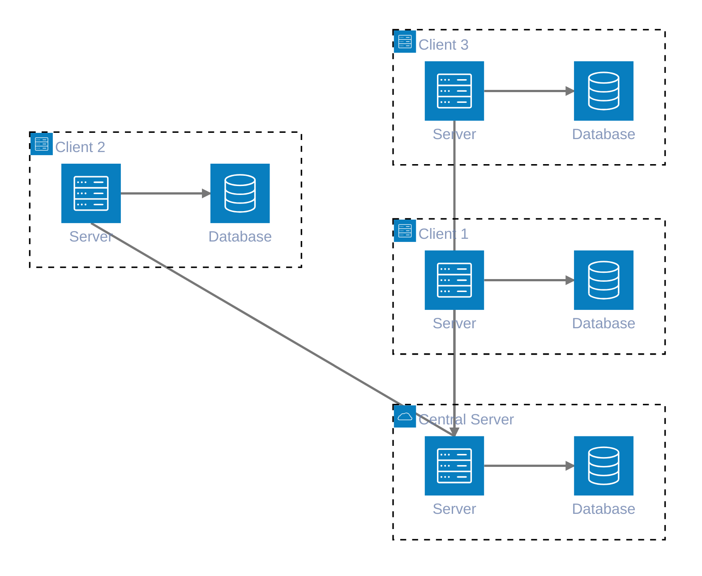

```mermaid
%%{init:{'theme':'base','themeVariables':{'primaryColor':'#6A7FAB','primaryTextColor':'#FAFBF9','primaryBorderColor':'#6A7FAB','lineColor':'#6A7FABCC','textColor':'#6A7FABCC','fontSize':'20px'}}}%%
architecture-beta
	
	group client1(server)[Client 1]
		service db_client1(database)[Database] in client1
		service server_client1(server)[Server] in client1
	
	group client2(server)[Client 2]
		service db_client2(database)[Database] in client2
		service server_client2(server)[Server] in client2
	
	group client3(server)[Client 3]
		service db_client3(database)[Database] in client3
		service server_client3(server)[Server] in client3
	
	group central(cloud)[Central Server]
		service db_central(database)[Database] in central
		service server_central(server)[Server] in central
	
	server_client1:R --> L:db_client1
	server_client2:R --> L:db_client2
	server_client3:R --> L:db_client3
	
	server_client1:B --> T:server_central
	server_client2:B --> T:server_central
	server_client3:B --> T:server_central
	
	server_central:R --> L:db_central
```