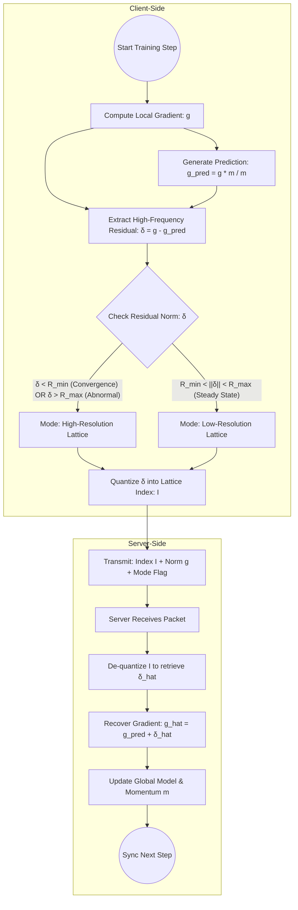

## Characteristics of the sources
>[! Main Question]
>1. Do the gradient vectors of a single NN obey I.I.D gaussian source?
>2. If don't,  how will it be descrived?  what type of assumption will be appropriate for the distribution of the vectors?.

### Adam (*Ada*ptive *m*omentum optimizor)

![[Pasted image 20251230114616.png]]
## Concept
- Switch **1-dimensional compression** and  **normal lattice quantization** 
	- $cos(g_t,g_{t+1})\sim 1$  part : we just send the norm of the 2nd difference of the gradient vectors of NN. 
	- $\cos(g_t, g_{t+1})<<1$ part: we have to send  the 2nd difference vectors.
## History of Weight Forecasting/ Accelaration for Neural Networks
- Introspection (2017)
- WNN; Weight Nowcaster Network (2023)
	- periodic skip steps 
	- good for short-range, bad for long-range forecasting
- Farcasting with LFD-2(2024)
- NiNo (2025)
	- a graph-based approach
- Introduce some assumptions
	- we can consider "Flow-based and Time-continuous model"
	- this approach intepret the gradient update as a dynamics which is constrainted by an ODE(Ordinary Differecial Equation)
		- Neural ODE(2018)
			- computationally expensive due to the need for numerical integration
			- not good for high-dimensional models
	-  While we adopt Gaus-

sian initialization for theoretical convenience, modern deep learning models often employ more

structured initialization schemes

