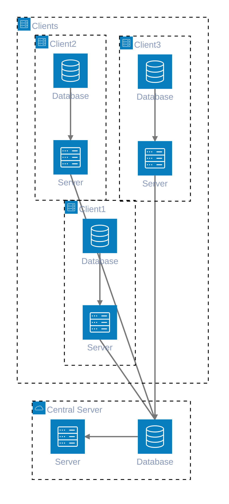

```mermaid
%%{init:{'theme':'base','themeVariables':{'primaryColor':'#6A7FAB','primaryTextColor':'#FAFBF9','primaryBorderColor':'#6A7FAB','lineColor':'#6A7FABCC','textColor':'#6A7FABCC','fontSize':'20px'}}}%%
architecture-beta
    %% =========================
    %% Federated Learning (FL)
    %% =========================

    group api(cloud)[Central Server]
		service db(database)[Database] in api
		service server(server)[Server] in api
		
		db:L-->R:server
		
	group clients(server)[Clients]
		group client1(server)[Client1] in clients
			service db_client1(database)[Database] in client1
			service server_client1(server)[Server] in client1
		group client2(server)[Client2] in clients
			service db_client2(database)[Database] in client2
			service server_client2(server)[Server] in client2
		group client3(server)[Client3] in clients
			service db_client3(database)[Database] in client3
			service server_client3(server)[Server] in client3
			db_client1:B-->T:server_client1
			
			db_client2:B-->T:server_client2
			
			db_client3:B-->T:server_client3
			
			server_client1:B-->T:db
			
			server_client2:B-->T:db
			
			server_client3:B-->T:db
			
```