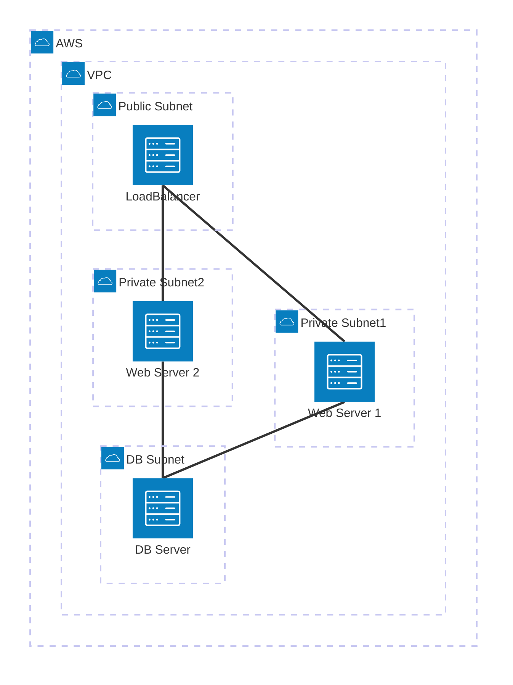

```mermaid
architecture-beta

    group aws(cloud)[AWS]
    group vpc(cloud)[VPC] in aws
    group public_subnet(cloud)[Public Subnet] in vpc

    group private_subnet1(cloud)[Private Subnet1] in vpc

    group private_subnet2(cloud)[Private Subnet2] in vpc

    group db_subnet(cloud)[DB Subnet] in vpc

    service load_balancer(server)[LoadBalancer] in public_subnet

    service web_server1(server)[Web Server 1] in private_subnet1

    service web_server2(server)[Web Server 2] in private_subnet2

    service db_server(server)[DB Server] in db_subnet

    load_balancer:B -- T:web_server1

    load_balancer:B -- T:web_server2

    web_server1:B -- T:db_server

    web_server2:B -- T:db_server
```